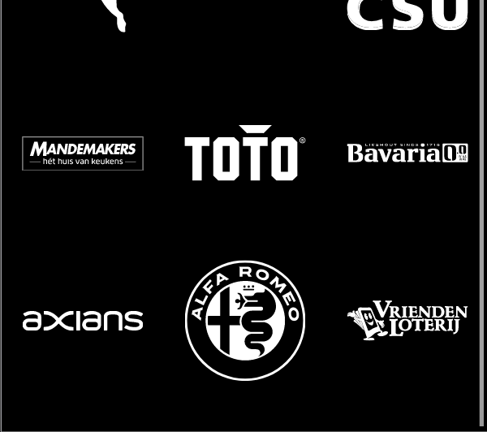
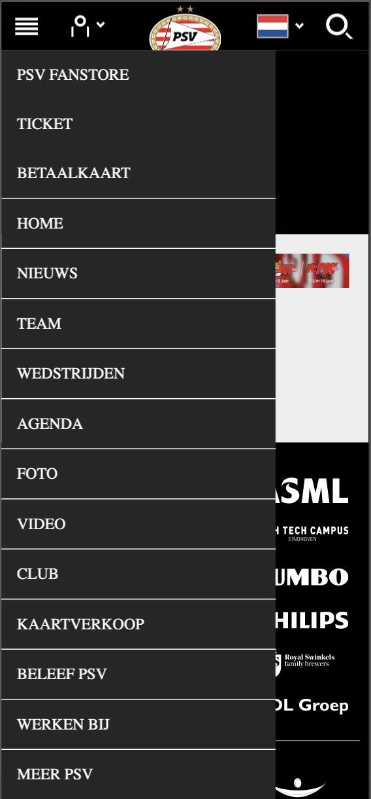

# Procesverslag
**Auteur:** -Renzo Ertmann-

## Bronnenlijst
1. Sanne voor de Timeout functie.
2. Jody Lorist heeft geholpen met het debuggen van mijn footer en met de navbar.
3. Bas Vugts heeft me geholpen met het debuggen van de code

## Eindgesprek (week 7/8)

-dit ging goed & dit was lastig-
Afgelopen vrijdag had ik gelukkig een gesprek met Sanne, en ik kwam er achter dat ik nog veel moest doen. Mijn ontwerp was alleen voor de Iphone 11 Pro Max beschikbaar, maar ik heb het dit weekend responsive gemaakt voor alle Iphone modellen. Het is me gelukkig gelukt om het af te krijgen.

**Screenshot(s):**

-screenshot(s) van je eindresultaat-

-pagina 1:
 
 

-pagina 2:
 

## Voortgang 3 (week 6)

### Stand van zaken

-dit ging goed & dit was lastig-
Ik heb deze week erg veel gestoeid met mijn navigatie bar. Ik had van Sanne een stukje code gekregen om een animatie te maken, maar die had mijn laptop helaas niet opgeslagen. Ik heb tot twee keer aan toe de code opniew moeten maken, maar nu ben ik erg blij met mijn resultaat. Ik heb af wat ik af wou hebben.

**Screenshot(s):**

 

-screenshot(s) van hoe ver je bent-
 
 

### Agenda voor meeting
 

### Verslag van meeting

-na afloop snel uitkomsten 
...

## Voortgang 2 (week 5)

### Stand van zaken

-dit ging goed & dit was lastig-
Ik ben deze week begonnen met het maken van de tweede pagina. Ik had vorige week de eerste pagina afgerond. Deze week had ik de challenge om een nieuwe navigatiebar te maken, en dat is mij na paar uur stoeien met de code aardig gelukt. Ook Heb ik een Javascript toegevoegd, omdat de tweede pagina 5 afbeeldingen moet vervangen om de 8 seconden. Ik ben erg blij dat het mij is gelukt om de navigatiebar af te krijgen. Ik ben daar heel erg trots op.

**Screenshot(s):**

 

-screenshot(s) van hoe ver je bent-
 

### Agenda voor meeting
 

### Verslag van meeting

-na afloop snel uitkomsten vastleggen-
Ik heb antwoorden gekregen op de vragen die ik had. Sanne had me geholpen met een stukje code en daar ben ik erg blij mee. Vanaf deze week ga ik stoeien om een hamburgermenu te kruigen die werkt.

## Voortgang 1 (week 3)

### Stand van zaken

-dit ging goed & dit was lastig-
Het is mij gelukt om de start pagina van psv.nl te maken. Ik had veel moeite om de footer netjes te krijgen maar door de functies 'first-of-type' en 'last-of-type' te gebruiken is het mij toch gelukt. Ik kijk er erg trots op terug. Nu komt de grootste uitdaging en dat is de homepage van psv.nl na te maken.

**Screenshot(s):**

 

-screenshot(s) van hoe ver je bent-
 
 

### Agenda voor meeting
 

### Verslag van meeting

-na afloop snel uitkomsten vastleggen-
Ik had niet zo heel veel vragen, maar ik op de vraag die ik stelde kreeg ik duideluik antwoord. Ik heb een link gekregen om een Javascript interval te gaan maken.

## Intake (week 1)

**Je startniveau:** Ik kies voor de blauwe piste.

**Je focus:** Ik kies voor de surface plane.

**Je opdracht:** https://www.psv.nl/psv/home.htm

**Screenshot(s):** 

 

**Breakdown-schets(en):**

